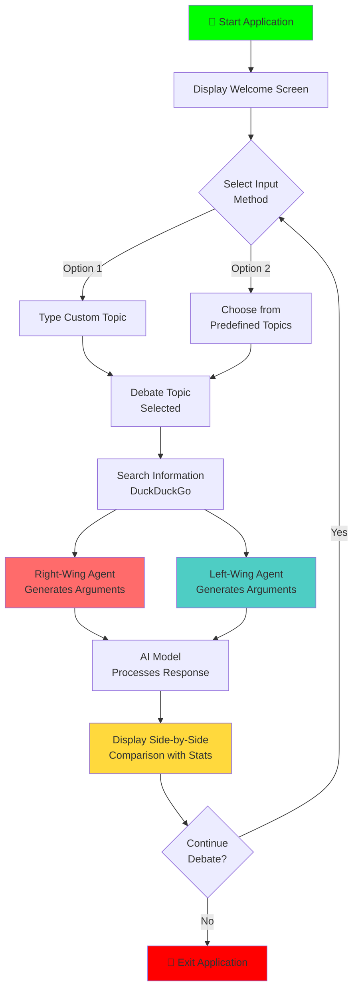

# Win My Argument

A political debate comparison tool that generates arguments from different political viewpoints on any given topic, displayed in an interactive side-by-side TUI format.

## Description

Win My Argument is a Python TUI application that simulates political debates between left-wing and right-wing perspectives. It uses pydantic-ai agents with local LLM models (via Ollama) to generate realistic arguments that compare different political viewpoints.

The application:

1. Takes a debate topic as input (custom or from predefined list)
2. Generates responses from both right-wing and left-wing perspectives in parallel
3. Uses DuckDuckGo search to gather relevant information for each perspective
4. Displays arguments side-by-side with model performance statistics
5. Allows comparison of arguments in an intuitive TUI layout

## Screenshot


## Installation

```bash
# Clone the repository
git clone https://github.com/c2p-cmd/win_my_argument.git
cd win_my_argument

# Create a virtual environment
python -m venv venv
source venv/bin/activate  # On Windows: venv\Scripts\activate

# Install dependencies
pip install -r requirements.txt
```

## Usage

Run the interactive TUI application:

```bash
python main.py
```

### Interactive Features

1. **Welcome Screen** - Application introduction with key information
2. **Topic Selection** - Choose between:
   - Typing your own debate topic
   - Selecting from 10 predefined political topics
3. **Live Debate Generation** - Watch as arguments are generated
4. **Side-by-Side Comparison** - View arguments in split-pane layout:
   - 🔴 Right-wing argument (red, left panel)
   - 🔵 Left-wing argument (cyan, right panel)
5. **Performance Statistics** - See detailed model stats for each side:
   - Total tokens used
   - Input/output token breakdown
   - Tokens per second (generation speed)
   - Response time

### Application Flow



## Project Structure

```
win_my_argument/
├── main.py                    # Main TUI entry point
├── debater/                   # Core debate module
│   ├── __init__.py
│   └── debate/
│       ├── __init__.py
│       ├── agents.py          # AI agent configuration
│       ├── model.py           # Data models and system prompts
│       └── service.py         # Debate orchestration and stats
├── requirements.txt           # Python dependencies
├── README.md                  # This file
└── LICENSE                    # MIT License
```

## Configuration

The application defaults to US political figures, but can be configured for other countries by modifying the `__country` variable in `debater/debate/model.py`.

### Currently supported countries

- **US** - Donald Trump vs Joe Biden
- **DE** - Alice Weidel vs Olaf Scholz
- **IN** - BJP vs INC

To change country, edit this line in `debater/debate/model.py`:

```python
__country = "US"  # Change to "DE" or "IN"
```

## Requirements

The application requires:

- **Python 3.8+**
- **Ollama** - For running local LLM models

### Key Python dependencies

- `pydantic-ai` - Agent-based AI workflows
- `rich` - Beautiful terminal UI components
- `prompt_toolkit` - Interactive command-line interface
- `duckduckgo_search` - Information retrieval
- `dotenv` - Environment configuration

## Features

- ✨ **Interactive TUI** - Beautiful terminal interface with Rich
- ⚖️ **Side-by-Side Comparison** - Easy argument comparison
- 📊 **Performance Metrics** - Track model efficiency with tokens/sec
- 🎯 **Predefined Topics** - 10 pre-selected debate topics
- 🔧 **Customizable** - Support for multiple countries and viewpoints
- 🚀 **Fast Generation** - Uses local Ollama models for privacy

## How It Works

1. **User Input** - Select or enter a debate topic
2. **Parallel Processing** - Both agents process the topic simultaneously
3. **Information Gathering** - DuckDuckGo search for context
4. **Argument Generation** - LLM generates arguments matching political perspective
5. **Display** - Results shown in split-pane with statistics

## License

[MIT](LICENSE)
